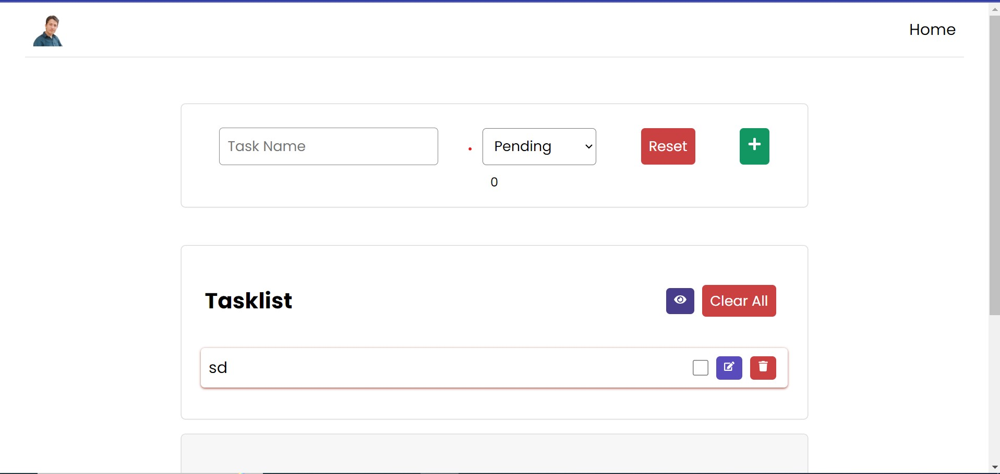
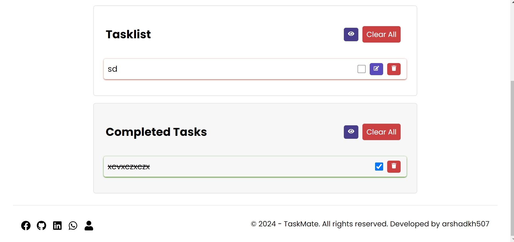

# TaskMate - Your Ultimate Task Management App

TaskMate is a feature-rich Todo App designed to streamline your task management process. Whether you're a professional or a student, TaskMate is here to help you organize and conquer your daily tasks.

## Features

- **Add Tasks**: Easily add tasks with a clean and intuitive user interface.
- **Task Completion**: Mark tasks as completed to keep track of your progress.
- **Local Storage**: Your tasks persist even if you close or reload the app.
- **Responsive Design**: Enjoy a seamless experience on various screen sizes.

## Screenshots


*Todo Top*


*Todo Bottom*

## Technologies Used

- **React**: A powerful JavaScript library for building the user interface.
- **React Icons**: Provides a set of sleek and modern icons for enhanced visuals.
- **React Toastify**: Offers a notification system for a delightful user experience.

## Getting Started

To get started with TaskMate, follow these simple steps:

1. Clone the repository:

   ```bash
   git clone https://github.com/arshadkh507/Todo-App-in-ReactJS.git
   cd Todo-App-in-ReactJS

2. Install dependencies:

   ```bash
    npm install

3. Run the application:

   ```bash
    npm start

## Explore TaskMate

Curious to see TaskMate in action? [Check it out here!](https://arshadkh507-todo-app.netlify.app/)

## Connect with Me

- **LinkedIn:** [Arshad Khan](https://www.linkedin.com/in/arshad-khan-2a6923213/)
- **GitHub:** [arshadkh507](https://github.com/arshadkh507)
- **Portfolio:** [arshadkh507.github.io](https://arshadkh507.github.io./)
- **Facebook:** [arshad.code.master](https://web.facebook.com/code.master.arshad/)

## Feedback and Contributions

I welcome your feedback and contributions to enhance TaskMate! Feel free to open an issue or submit a pull request.


# Todo App

## Project Architecture:

### Components:

- **App:** Main component integrating other components.
- **Header:** Displays logo and navigation links.
- **Footer:** Contains social icons and copyright information.
- **AddTask:** Allows users to add new tasks.
- **TaskList:** Displays pending tasks.
- **TaskCard:** Represents an individual task in the pending list.
- **CompletedTasks:** Displays completed tasks.
- **CompletedTaskCard:** Represents an individual completed task.

### Styling:

- **CSS Files:** Separate files for each component.
- **Logo and Icons:** External assets for branding.

### State Management:

- **React State (useState):** Manages task state.
- **localStorage:** Persists tasks in the browser.

### External Libraries:

- **React Icons:** Adds icons to the UI.
- **React Toastify:** Displays toast notifications.

## Flowchart:

1. **Initialization:**
   - App initializes state using useState.
   - useEffect retrieves tasks from localStorage on mount.

2. **Rendering:**
   - Header, Footer, and main sections are rendered.
   - Main sections include AddTask, TaskList, CompletedTasks.

3. **AddTask:**
   - User inputs task name and selects completion status.
   - handleSubmit adds task to tasks array using setTasks.

4. **TaskList:**
   - Displays pending tasks using TaskCard components.
   - Provides delete or edit options.

5. **CompletedTasks:**
   - Displays completed tasks using CompletedTaskCard components.
   - Offers an option to delete all completed tasks.

6. **TaskCard and CompletedTaskCard:**
   - Render individual task details.
   - Provide options to delete tasks.

7. **Local Storage:**
   - useEffect ensures tasks are saved to localStorage on any state change.

8. **Toast Notifications:**
   - Displayed for successful task addition and errors.

9. **Footer:**
   - Social icons link to external profiles.
   - Contains copyright information and developer details.

## License

This project is licensed under the MIT License - see the [LICENSE](LICENSE) file for details.

## Acknowledgments

Special thanks to the React community for their continuous support and inspiration.
